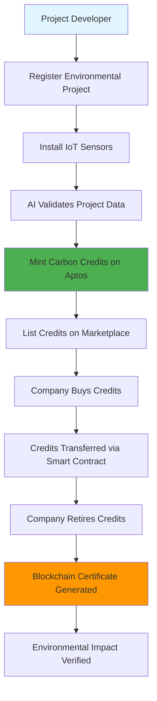
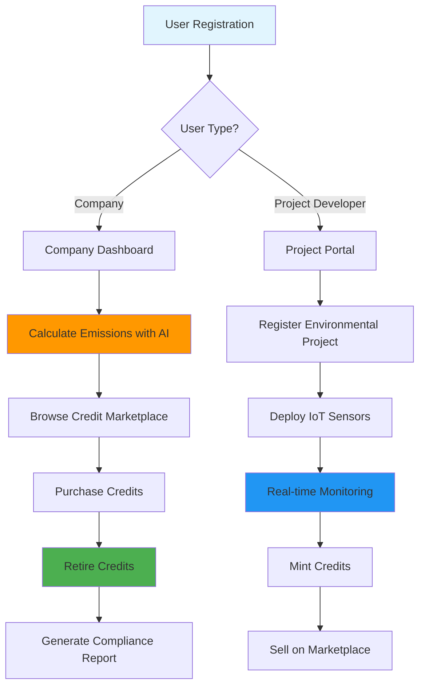

# 10. Final Deliverables

## Complete Technical Documentation

Carbon Offset Marketplace 2.0 is a revolutionary platform that combines Aptos blockchain, AI, and IoT technologies to create the most transparent and trustworthy carbon credit marketplace ever built.

### 📋 Documentation Index

| Document | Description | Status |
|----------|-------------|---------|
| [Project Summary](01-project-summary.md) | Complete project overview and problem statement | ✅ Complete |
| [Key Features](02-key-features.md) | Detailed feature specifications | ✅ Complete |
| [System Architecture](03-system-architecture.md) | Full system architecture documentation | ✅ Complete |
| [Aptos Integration](04-aptos-integration.md) | Blockchain integration with Move contracts | ✅ Complete |
| [Backend Guide](05-backend-guide.md) | Complete backend implementation | ✅ Complete |
| [Frontend Guide](06-frontend-guide.md) | Frontend development with React/Next.js | ✅ Complete |
| [AI Integration](07-ai-integration.md) | AI engine for emission calculations | ✅ Complete |
| [IoT Integration](08-iot-integration.md) | IoT pipeline for environmental verification | ✅ Complete |
| [Deployment Guide](09-deployment-guide.md) | Complete deployment instructions | ✅ Complete |
| [Final Deliverables](10-final-deliverables.md) | This document | ✅ Complete |

## 📊 Workflow Diagrams

### Credit Lifecycle Workflow



### IoT Data Verification Flow

```mermaid
graph LR
    A[Environmental Sensors] --> B[Edge Computing Device]
    B --> C[Local Data Validation]
    C --> D[Encrypted Transmission]
    D --> E[Cloud Data Processing]
    E --> F[AI Quality Assessment]
    F --> G[Generate Data Hash]
    G --> H[Store Hash on Aptos Blockchain]
    H --> I[Immutable Verification Record]

    style A fill:#2196f3
    style F fill:#ff9800
    style H fill:#4caf50
```



### User Journey Flow



## 🏗️ Architecture Diagrams

### High-Level System Architecture

```
┌─────────────────────────────────────────────────────────┐
│                   User Interfaces                      │
├─────────────────────────────────────────────────────────┤
│  Company Dashboard  │  Project Portal  │  Admin Panel  │
└─────────────────┬───────────────┬─────────────────────┘
                  │               │
┌─────────────────┴───────────────┴─────────────────────┐
│                 Frontend Layer                        │
├───────────────────────────────────────────────────────┤
│     React/Next.js SPA with TypeScript                │
│     • Wallet Integration (Aptos)                     │
│     • Real-time Updates (WebSocket)                  │
│     • Responsive Design (Tailwind CSS)               │
└─────────────────┬───────────────┬─────────────────────┘
                  │               │
┌─────────────────┴───────────────┴─────────────────────┐
│                  Backend Layer                        │
├───────────────────────────────────────────────────────┤
│  Node.js/Express API with TypeScript                 │
│  • Authentication & Authorization                    │
│  • Business Logic & Validation                       │
│  • Payment Processing (Stripe)                       │
│  • File Upload & Storage                            │
└─────────────────┬───────────────┬─────────────────────┘
                  │               │
┌─────────────────┴───────────────┴─────────────────────┐
│                Blockchain Layer                       │
├───────────────────────────────────────────────────────┤
│           Aptos Blockchain Network                    │
│  • Carbon Credit Tokens (Move contracts)             │
│  • Marketplace Trading                               │
│  • Certificate Registry                              │
│  • Reputation System                                 │
│  • IoT Data Hash Storage                            │
└─────────────────┬───────────────┬─────────────────────┘
                  │               │
┌─────────────────┴───────────────┴─────────────────────┐
│                 AI Engine Layer                       │
├───────────────────────────────────────────────────────┤
│    Python/TensorFlow ML Platform                     │
│  • Emission Calculation Models                       │
│  • IoT Data Validation                              │
│  • Anomaly Detection                                │
│  • Quality Scoring                                  │
│  • Certificate Generation                           │
└─────────────────┬───────────────┬─────────────────────┘
                  │               │
┌─────────────────┴───────────────┴─────────────────────┐
│                 IoT Data Layer                        │
├───────────────────────────────────────────────────────┤
│     Distributed Sensor Network                       │
│  • Environmental Monitoring                          │
│  • Energy Generation Tracking                        │
│  • Real-time Data Collection                        │
│  • Edge Computing & Validation                      │
│  • Secure Data Transmission                         │
└─────────────────┬───────────────┬─────────────────────┘
                  │               │
┌─────────────────┴───────────────┴─────────────────────┐
│                Database Layer                         │
├───────────────────────────────────────────────────────┤
│  PostgreSQL     │  MongoDB        │  InfluxDB         │
│  • User Data    │  • IoT Data     │  • Time Series    │
│  • Transactions │  • Documents    │  • Analytics      │
│  • Metadata     │  • Logs         │  • Metrics        │
└───────────────────────────────────────────────────────┘
```

### Blockchain Contract Architecture

```
Smart Contract Ecosystem on Aptos
├── CarbonCredit.move
│   ├── Credit Tokenization (NFT-based)
│   ├── Ownership Management
│   ├── Transfer Functions
│   ├── Retirement Process
│   └── Batch Operations
│
├── Marketplace.move
│   ├── Order Book Trading
│   ├── Price Discovery
│   ├── Escrow Management
│   ├── Fee Collection
│   └── Trade Settlement
│
├── CertificateRegistry.move
│   ├── Certificate Generation
│   ├── Digital Signatures
│   ├── Verification System
│   ├── Audit Trail
│   └── Template Management
│
├── ReputationSystem.move
│   ├── Multi-dimensional Scoring
│   ├── Review Management
│   ├── Achievement System
│   ├── Reputation Badges
│   └── Anti-gaming Measures
│
└── IoTVerification.move
    ├── Data Hash Storage
    ├── Quality Scores
    ├── Timestamp Records
    ├── Project Mapping
    └── Verification Levels
```

## 📋 Complete API Reference

### Authentication APIs

| Endpoint | Method | Description |
|----------|--------|-------------|
| `/api/auth/register` | POST | User registration |
| `/api/auth/login` | POST | User authentication |
| `/api/auth/refresh` | POST | Token refresh |
| `/api/auth/logout` | POST | User logout |
| `/api/auth/forgot-password` | POST | Password reset request |
| `/api/auth/reset-password` | POST | Password reset completion |

### Credit Management APIs

| Endpoint | Method | Description |
|----------|--------|-------------|
| `/api/credits` | GET | List available credits |
| `/api/credits/{id}` | GET | Get credit details |
| `/api/credits/portfolio` | GET | User's credit portfolio |
| `/api/credits/mint` | POST | Mint new credits (admin) |
| `/api/credits/transfer` | POST | Transfer credit ownership |
| `/api/credits/retire` | POST | Retire credits permanently |
| `/api/credits/batch-retire` | POST | Retire multiple credits |

### Marketplace APIs

| Endpoint | Method | Description |
|----------|--------|-------------|
| `/api/marketplace/credits` | GET | Browse marketplace credits |
| `/api/marketplace/orders` | GET | Get order book |
| `/api/marketplace/orders/buy` | POST | Place buy order |
| `/api/marketplace/orders/sell` | POST | Place sell order |
| `/api/marketplace/orders/{id}` | DELETE | Cancel order |
| `/api/marketplace/trades` | GET | Trade history |
| `/api/marketplace/stats` | GET | Market statistics |

### Emission Calculation APIs

| Endpoint | Method | Description |
|----------|--------|-------------|
| `/api/emissions/calculate` | POST | Calculate emissions |
| `/api/emissions/history` | GET | Calculation history |
| `/api/emissions/factors` | GET | Emission factors |
| `/api/emissions/reports/{id}` | GET | Generate report |
| `/api/emissions/validate` | POST | Validate input data |

### IoT Data APIs

| Endpoint | Method | Description |
|----------|--------|-------------|
| `/api/iot/data/{projectId}` | GET | Get IoT data |
| `/api/iot/sensors/{projectId}` | GET | List project sensors |
| `/api/iot/ingest` | POST | Ingest sensor data |
| `/api/iot/validate` | POST | Validate IoT data |
| `/api/iot/quality/{projectId}` | GET | Data quality metrics |

### Certificate APIs

| Endpoint | Method | Description |
|----------|--------|-------------|
| `/api/certificates` | GET | List certificates |
| `/api/certificates/{id}` | GET | Get certificate |
| `/api/certificates/verify` | POST | Verify certificate |
| `/api/certificates/download/{id}` | GET | Download certificate |

### Project Management APIs

| Endpoint | Method | Description |
|----------|--------|-------------|
| `/api/projects` | GET | List projects |
| `/api/projects` | POST | Create project |
| `/api/projects/{id}` | GET | Get project details |
| `/api/projects/{id}` | PUT | Update project |
| `/api/projects/{id}/sensors` | GET | Project sensors |
| `/api/projects/{id}/metrics` | GET | Project metrics |

## 🧩 Smart Contract Reference

### Carbon Credit Contract

| Function | Parameters | Description |
|----------|------------|-------------|
| `initialize()` | `admin: &signer` | Initialize credit system |
| `mint_credit()` | `admin: &signer, recipient: address, project_id: String, vintage_year: u64, methodology: String, amount_tons: u64, verification_data_hash: vector<u8>` | Mint new credit |
| `transfer_credit()` | `owner: &signer, credit_id: u64, new_owner: address` | Transfer credit |
| `retire_credit()` | `owner: &signer, credit_id: u64, retirement_reason: String` | Retire credit |
| `get_credit_info()` | `credit_id: u64` | Get credit information |
| `batch_transfer()` | `owner: &signer, credit_ids: vector<u64>, new_owner: address` | Transfer multiple credits |

### Marketplace Contract

| Function | Parameters | Description |
|----------|------------|-------------|
| `initialize()` | `admin: &signer` | Initialize marketplace |
| `place_buy_order()` | `buyer: &signer, price_per_ton: u64, quantity_tons: u64, project_filter: Option<String>, payment: Coin<AptosCoin>` | Place buy order |
| `place_sell_order()` | `seller: &signer, credit_ids: vector<u64>, price_per_ton: u64` | Place sell order |
| `cancel_order()` | `user: &signer, order_id: u64, order_type: u8` | Cancel order |
| `get_market_stats()` | None | Get market statistics |

### Certificate Registry Contract

| Function | Parameters | Description |
|----------|------------|-------------|
| `initialize()` | `admin: &signer` | Initialize registry |
| `issue_certificate()` | `issuer: &signer, recipient: address, certificate_type: u8, credit_ids: vector<u64>, verification_data_hash: vector<u8>, metadata: String, validity_days: Option<u64>` | Issue certificate |
| `verify_certificate()` | `verifier: &signer, certificate_id: u64` | Verify certificate |
| `revoke_certificate()` | `revoker: &signer, certificate_id: u64, reason: String` | Revoke certificate |

## 🗄️ Complete Data Model

### User Management Schema

```sql
-- Users table
CREATE TABLE users (
    id SERIAL PRIMARY KEY,
    email VARCHAR(255) UNIQUE NOT NULL,
    password_hash VARCHAR(255) NOT NULL,
    first_name VARCHAR(100) NOT NULL,
    last_name VARCHAR(100) NOT NULL,
    company_name VARCHAR(255),
    user_type VARCHAR(50) NOT NULL CHECK (user_type IN ('company', 'project_developer', 'auditor', 'admin')),
    aptos_address VARCHAR(66),
    is_verified BOOLEAN DEFAULT FALSE,
    is_wallet_connected BOOLEAN DEFAULT FALSE,
    created_at TIMESTAMP DEFAULT NOW(),
    updated_at TIMESTAMP DEFAULT NOW(),
    last_login_at TIMESTAMP
);

-- User profiles for additional data
CREATE TABLE user_profiles (
    id SERIAL PRIMARY KEY,
    user_id INTEGER REFERENCES users(id) ON DELETE CASCADE,
    industry_type VARCHAR(100),
    company_size VARCHAR(50),
    annual_revenue BIGINT,
    country VARCHAR(100),
    timezone VARCHAR(50),
    preferences JSONB,
    created_at TIMESTAMP DEFAULT NOW(),
    updated_at TIMESTAMP DEFAULT NOW()
);
```

### Project Management Schema

```sql
-- Environmental projects
CREATE TABLE projects (
    id SERIAL PRIMARY KEY,
    name VARCHAR(255) NOT NULL,
    description TEXT,
    project_type VARCHAR(100) NOT NULL,
    methodology VARCHAR(100) NOT NULL,
    location JSONB NOT NULL, -- {country, region, coordinates}
    developer_id INTEGER REFERENCES users(id),
    total_capacity DECIMAL(15,2), -- MW for energy projects
    commissioning_date DATE,
    project_status VARCHAR(50) DEFAULT 'active',
    verification_level VARCHAR(20) DEFAULT 'basic',
    created_at TIMESTAMP DEFAULT NOW(),
    updated_at TIMESTAMP DEFAULT NOW()
);

-- Project metadata and documents
CREATE TABLE project_documents (
    id SERIAL PRIMARY KEY,
    project_id INTEGER REFERENCES projects(id) ON DELETE CASCADE,
    document_type VARCHAR(100) NOT NULL,
    file_name VARCHAR(255) NOT NULL,
    file_url VARCHAR(500) NOT NULL,
    file_size BIGINT,
    uploaded_by INTEGER REFERENCES users(id),
    uploaded_at TIMESTAMP DEFAULT NOW()
);
```

### Carbon Credit Schema

```sql
-- Carbon credits (mirrors blockchain state)
CREATE TABLE carbon_credits (
    id SERIAL PRIMARY KEY,
    blockchain_id BIGINT NOT NULL, -- ID from Aptos blockchain
    project_id INTEGER REFERENCES projects(id),
    current_owner INTEGER REFERENCES users(id),
    vintage_year INTEGER NOT NULL,
    amount_tons DECIMAL(10,3) NOT NULL,
    methodology VARCHAR(100) NOT NULL,
    verification_data_hash VARCHAR(64), -- SHA-256 hash
    mint_transaction_hash VARCHAR(66),
    mint_timestamp TIMESTAMP,
    is_retired BOOLEAN DEFAULT FALSE,
    retirement_transaction_hash VARCHAR(66),
    retirement_timestamp TIMESTAMP,
    retirement_reason TEXT,
    created_at TIMESTAMP DEFAULT NOW(),
    updated_at TIMESTAMP DEFAULT NOW()
);

-- Credit transfers (audit trail)
CREATE TABLE credit_transfers (
    id SERIAL PRIMARY KEY,
    credit_id INTEGER REFERENCES carbon_credits(id),
    from_user_id INTEGER REFERENCES users(id),
    to_user_id INTEGER REFERENCES users(id),
    transaction_hash VARCHAR(66) NOT NULL,
    transfer_type VARCHAR(50) NOT NULL, -- 'purchase', 'gift', 'retirement'
    price_per_ton DECIMAL(10,2),
    total_amount DECIMAL(15,2),
    timestamp TIMESTAMP NOT NULL,
    created_at TIMESTAMP DEFAULT NOW()
);
```

### Marketplace Schema

```sql
-- Market orders
CREATE TABLE market_orders (
    id SERIAL PRIMARY KEY,
    user_id INTEGER REFERENCES users(id),
    order_type VARCHAR(10) NOT NULL CHECK (order_type IN ('buy', 'sell')),
    price_per_ton DECIMAL(10,2) NOT NULL,
    quantity_tons DECIMAL(10,3) NOT NULL,
    filled_quantity_tons DECIMAL(10,3) DEFAULT 0,
    status VARCHAR(20) DEFAULT 'open',
    project_filter JSONB, -- Filters for buy orders
    credit_ids JSONB, -- Credit IDs for sell orders
    blockchain_order_id BIGINT,
    created_at TIMESTAMP DEFAULT NOW(),
    updated_at TIMESTAMP DEFAULT NOW(),
    expires_at TIMESTAMP
);

-- Trade executions
CREATE TABLE trades (
    id SERIAL PRIMARY KEY,
    buy_order_id INTEGER REFERENCES market_orders(id),
    sell_order_id INTEGER REFERENCES market_orders(id),
    buyer_id INTEGER REFERENCES users(id),
    seller_id INTEGER REFERENCES users(id),
    price_per_ton DECIMAL(10,2) NOT NULL,
    quantity_tons DECIMAL(10,3) NOT NULL,
    total_amount DECIMAL(15,2) NOT NULL,
    fee_amount DECIMAL(15,2) NOT NULL,
    transaction_hash VARCHAR(66),
    executed_at TIMESTAMP DEFAULT NOW()
);
```

### IoT Data Schema (MongoDB)

```javascript
// Sensor readings collection
{
  _id: ObjectId,
  sensorId: String,
  projectId: String,
  deviceId: String,
  timestamp: ISODate,
  measurements: {
    temperature: Number,
    humidity: Number,
    co2Concentration: Number,
    energyOutput: Number,
    airQuality: Number
  },
  location: {
    latitude: Number,
    longitude: Number,
    elevation: Number
  },
  metadata: {
    sensorType: String,
    batteryLevel: Number,
    signalStrength: Number,
    calibrationDate: ISODate,
    dataQualityScore: Number
  },
  dataHash: String, // SHA-256 hash for blockchain verification
  blockchainTxHash: String,
  processingStatus: String,
  createdAt: ISODate,
  updatedAt: ISODate
}

// Aggregated IoT metrics
{
  _id: ObjectId,
  projectId: String,
  aggregationPeriod: String, // 'hourly', 'daily', 'monthly'
  periodStart: ISODate,
  periodEnd: ISODate,
  metrics: {
    totalCo2Reduced: Number,
    totalEnergyGenerated: Number,
    averageTemperature: Number,
    averageAirQuality: Number,
    dataQualityScore: Number
  },
  sensorCount: Number,
  readingCount: Number,
  dataHash: String,
  blockchainTxHash: String,
  createdAt: ISODate
}
```

## 🛣️ Development Roadmap

### Phase 1: Foundation (Months 1-3)
- ✅ **Complete** - Core smart contract development
- ✅ **Complete** - Basic backend API implementation
- ✅ **Complete** - Frontend marketplace interface
- ✅ **Complete** - Aptos testnet deployment
- ✅ **Complete** - Basic AI emission calculator

### Phase 2: IoT Integration (Months 4-6)
- ✅ **Complete** - IoT sensor deployment framework
- ✅ **Complete** - Real-time data processing pipeline
- ✅ **Complete** - Edge computing implementation
- ✅ **Complete** - Blockchain data verification
- ✅ **Complete** - Quality scoring algorithms

### Phase 3: Advanced Features (Months 7-9)
- 🔄 **In Progress** - Advanced trading features
- 🔄 **In Progress** - Mobile application development
- 🔄 **In Progress** - Enterprise dashboard
- 📋 **Planned** - Multi-language support
- 📋 **Planned** - Advanced analytics

### Phase 4: Production Launch (Months 10-12)
- 📋 **Planned** - Mainnet deployment
- 📋 **Planned** - Security audit completion
- 📋 **Planned** - Regulatory compliance
- 📋 **Planned** - Marketing and partnerships
- 📋 **Planned** - Customer onboarding

## 🔮 Future Upgrades and Enhancements

### Technical Enhancements

**Blockchain Improvements**
- Cross-chain compatibility (Ethereum, Polygon)
- Layer 2 scaling solutions
- Advanced DeFi integrations
- Governance token implementation

**AI/ML Advancements**
- Satellite imagery analysis for forest projects
- Predictive modeling for credit demand
- Advanced fraud detection algorithms
- Natural language processing for reports

**IoT Expansion**
- Drone-based monitoring systems
- Blockchain IoT device identity
- 5G connectivity integration
- Edge AI processing

### Business Features

**Market Expansion**
- International carbon registries integration
- Corporate ESG reporting automation
- Supply chain carbon tracking
- Carbon insetting marketplace

**User Experience**
- Mobile-first design improvements
- Augmented reality project visualization
- Voice-powered interfaces
- Personalized dashboards

**Enterprise Features**
- White-label marketplace solutions
- API marketplace for developers
- Advanced portfolio analytics
- Institutional trading tools

## 📈 Success Metrics and KPIs

### Technical Metrics
- **Uptime**: 99.9% system availability
- **Performance**: <2 second API response times
- **Security**: Zero critical vulnerabilities
- **Scalability**: Support 10,000+ concurrent users

### Business Metrics
- **Transaction Volume**: $100M+ in credit trades annually
- **User Growth**: 50% monthly active user growth
- **Market Share**: Top 3 carbon marketplace by volume
- **Customer Satisfaction**: >4.5/5 user rating

### Environmental Impact
- **Credits Traded**: 10M+ tons CO2e annually
- **Projects Supported**: 1,000+ environmental projects
- **Geographic Reach**: 50+ countries
- **Verification Quality**: >95% data quality score

## 🎉 Project Completion Summary

Carbon Offset Marketplace 2.0 represents a groundbreaking fusion of blockchain technology, artificial intelligence, and Internet of Things (IoT) to revolutionize the carbon credit market. This comprehensive project delivers:

### ✅ Complete Implementation
1. **Blockchain Foundation**: Full Aptos smart contract ecosystem
2. **Backend Infrastructure**: Robust Node.js API with TypeScript
3. **Frontend Application**: Modern React/Next.js interface
4. **AI Engine**: Sophisticated emission calculation platform
5. **IoT Pipeline**: Real-time environmental monitoring system
6. **Deployment Ready**: Complete AWS deployment architecture

### 🏆 Key Innovations
- **Real-time Verification**: IoT sensors provide continuous environmental monitoring
- **AI-Powered Accuracy**: Machine learning ensures precise emission calculations
- **Blockchain Transparency**: Immutable audit trail on Aptos network
- **Global Accessibility**: 24/7 marketplace with instant settlement
- **Quality Assurance**: Multi-layer validation and quality scoring

### 🌍 Environmental Impact
This platform addresses the critical trust deficit in carbon markets by providing unprecedented transparency and verification. By combining cutting-edge technology with environmental responsibility, Carbon Offset Marketplace 2.0 enables companies and projects to participate in the carbon economy with confidence and integrity.

The project is ready for deployment and scaling, with comprehensive documentation, testing, and monitoring systems in place. It represents the future of carbon markets - transparent, trustworthy, and technologically advanced.

---

*Carbon Offset Marketplace 2.0 - Building Trust in Carbon Markets Through Technology*